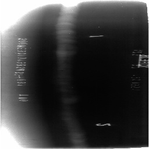
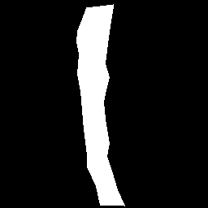
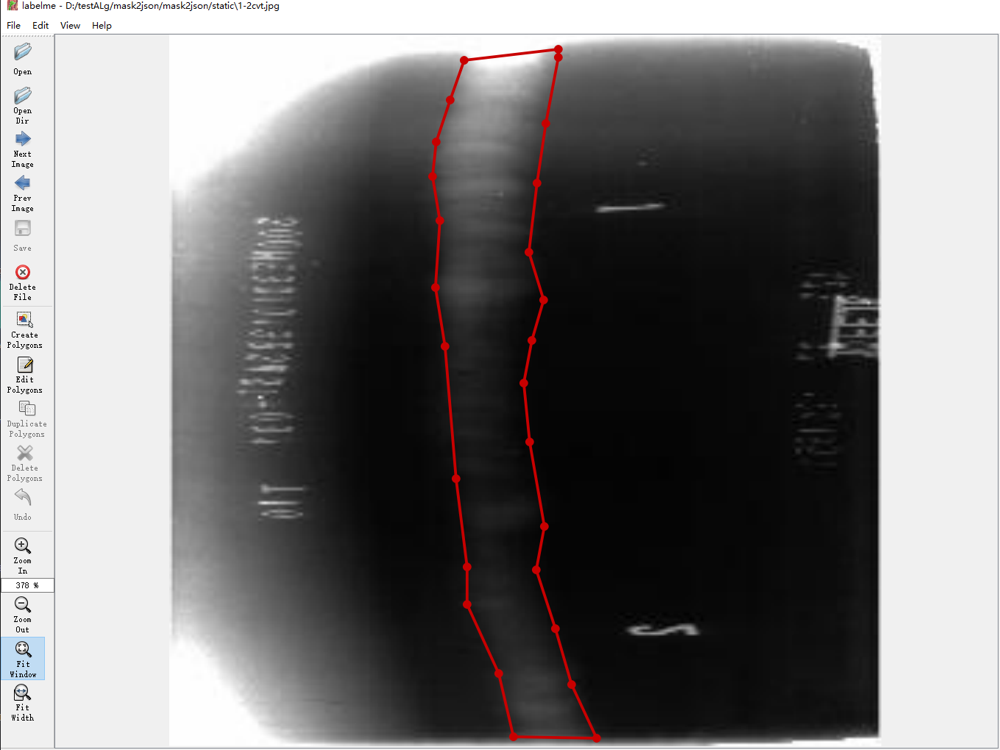
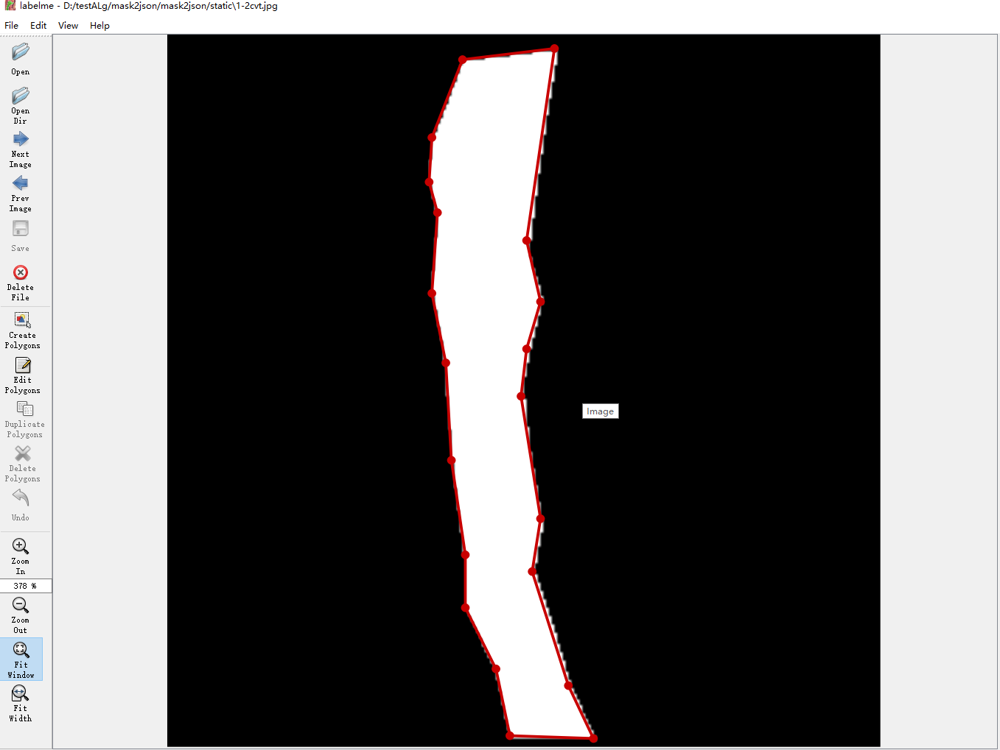
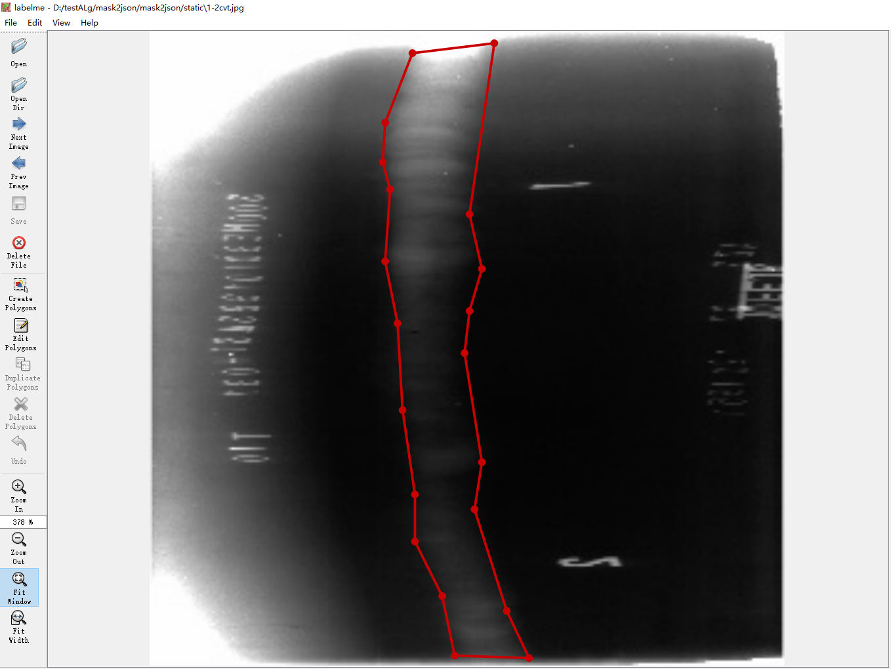
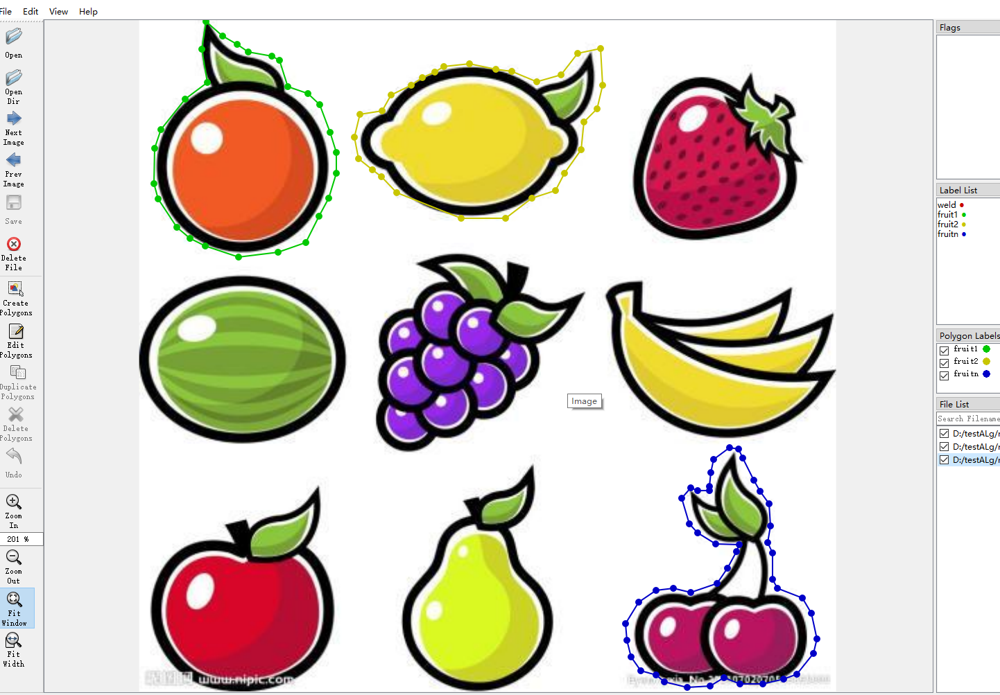
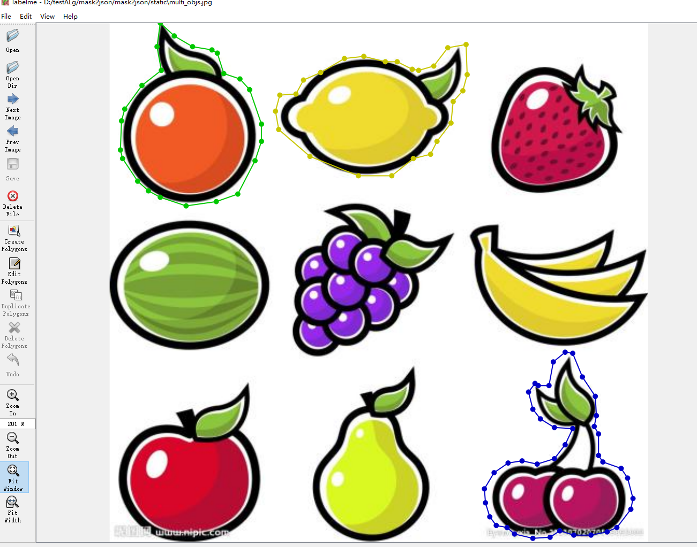
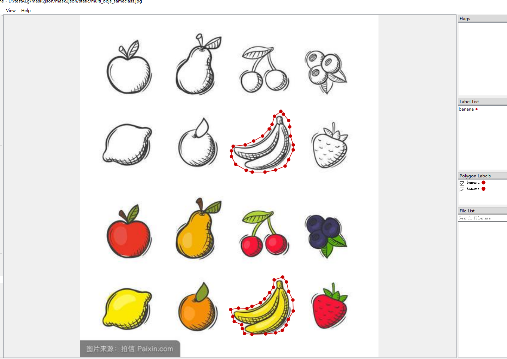

<!--
 * @lanhuage: markdown
 * @Descripttion: 
 * @version: beta
 * @Author: xiaoshuyui
 * @Date: 2020-06-09 16:23:03
 * @LastEditors: xiaoshuyui
 * @LastEditTime: 2020-07-10 09:35:13
--> 

# mask2json
 mask imgs to labelme jsons,and so on

 This script is used to convert mask-labels to json files for [labelme](https://github.com/wkentaro/labelme).

 Also ,json files to masks can be found on this [site](https://blog.csdn.net/gaoyi135/article/details/103870646). Sometimes there will be an ERROR,should add this [file](./backup/draw.py) in labelme path ('../anaconda/Lib/site-packages/labelme/utils ' my path) and add some codes in \_\_init__.py:

    from .draw import label_colormap
    from .draw import _validate_colormap
    from .draw import label2rgb
    from .draw import draw_label
    from .draw import draw_instances 

Here shows an example using this script.

origin image

mask image

manually_labeled image

auto_labeled image

Also ,for [labelimg](https://github.com/tzutalin/labelImg),a small tool to convert results(yolo) to [xml-files](./utils/img2xml). (I tested [single object](./utils/img2xml/processor_singleObj.py) but didn't test [multi objects](./utils/img2xml/processor_multiObj.py)

## 2020.6.12

### support multiple objects mask to json

try [test.py](./test.py) !

#### multiple objects in different classes

manually_labeled image

auto_labeled image

#### multiple objects in same classes

manually_labeled image

auto_labeled image

##  SHORTCOMING

1.~~objects connected to each other is not supported yet.~~

this may happen if you labelling multiple-object-images with only 2 labels .Or some objects are of the same type and are connected to each other(eg. a bunch of grapes,it is hard to split one to the other).

you can try [json2mask.py](./json2mask.py) to generate mask-files.

