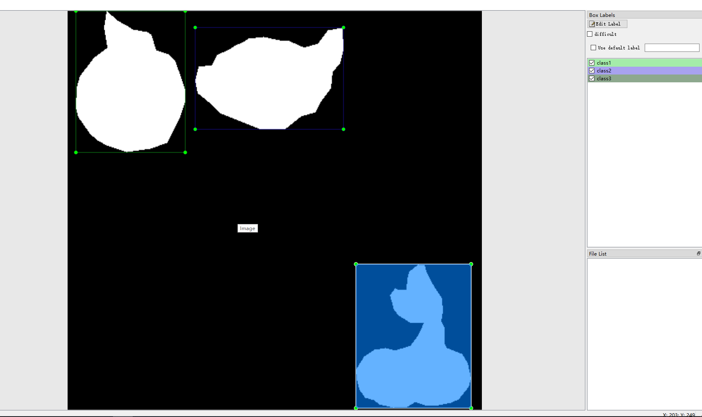
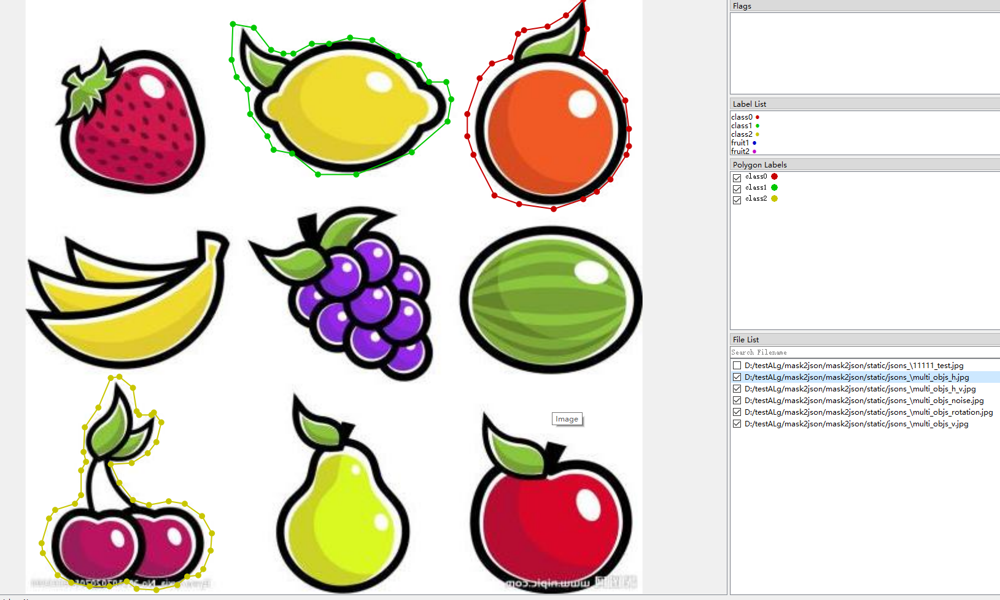
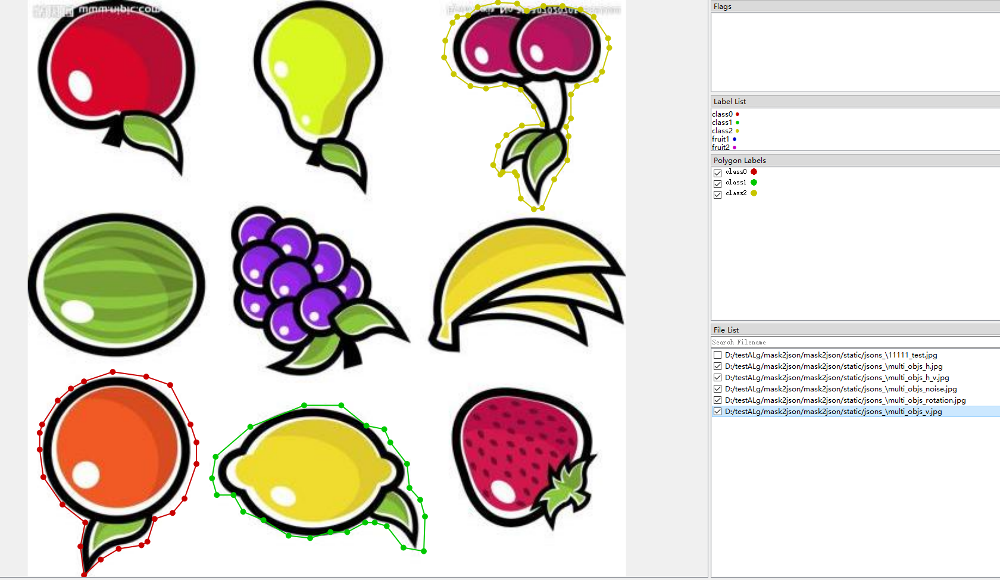
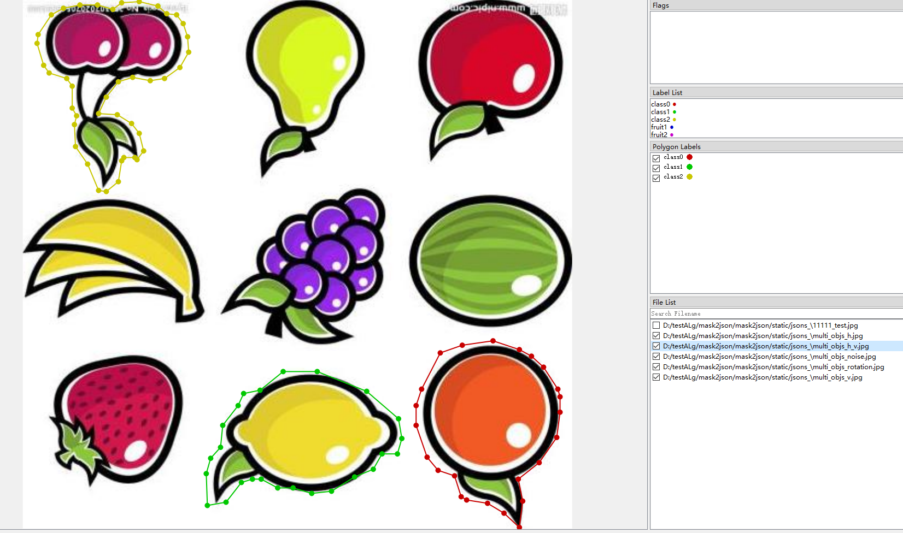
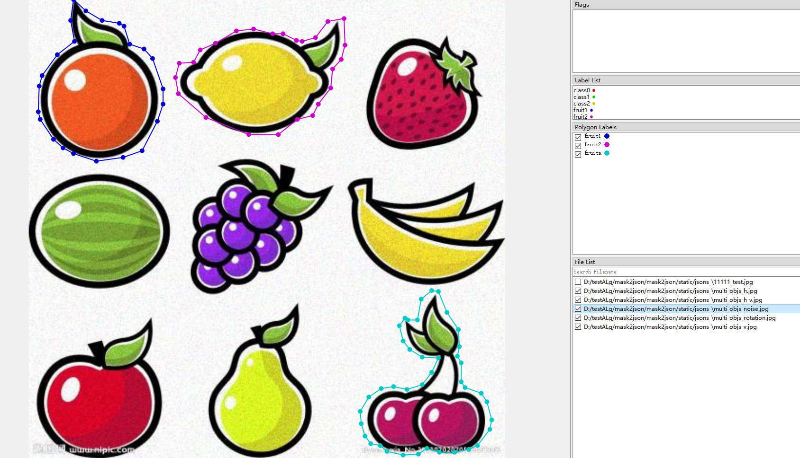
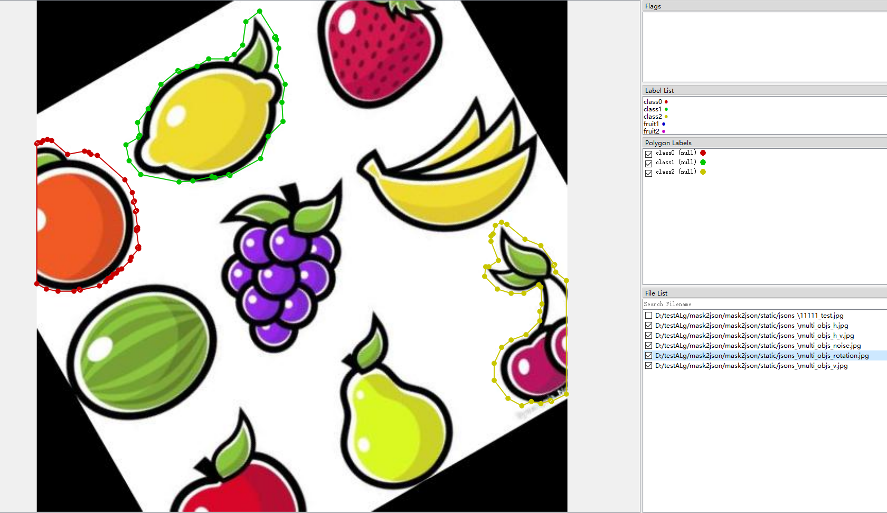
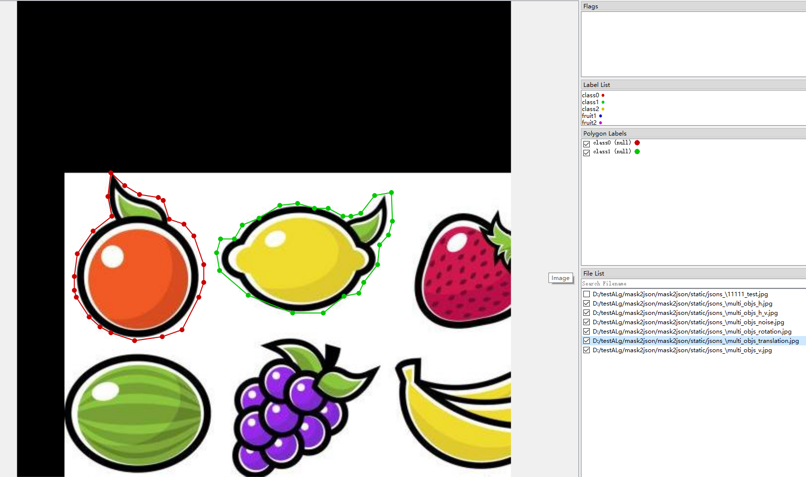
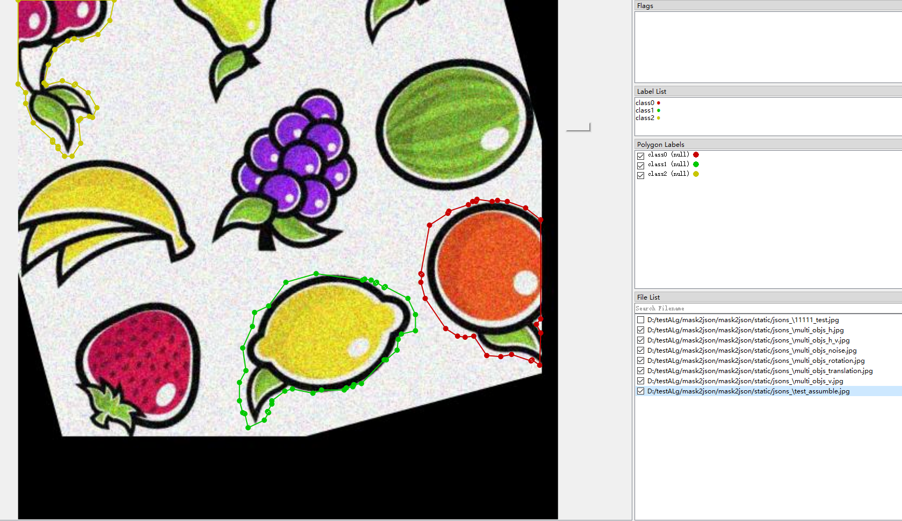
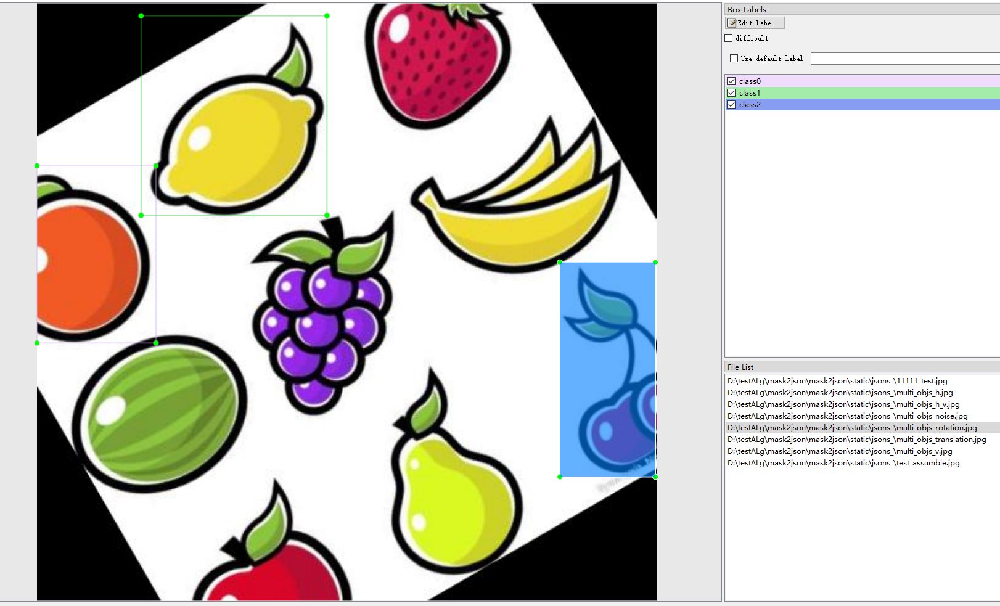

<!--
 * @lanhuage: markdown
 * @Descripttion: 
 * @version: 
 * @Author: xiaoshuyui
 * @Date: 2020-06-09 16:23:03
 * @LastEditors: xiaoshuyui
 * @LastEditTime: 2020-08-20 08:25:50
--> 

# mask2json

 a small tool for image augmentation, including mask files to json/xml files , image augmentation(flip,rotation,noise,...) and so on

 ## HOW TO USE

 This script is used to convert mask-labels to json files for [labelme](https://github.com/wkentaro/labelme).

 Also ,json files to masks can be found on this [site](https://blog.csdn.net/gaoyi135/article/details/103870646). Sometimes there will be an ERROR,should add this [file](./mask2json/draw.py) in labelme path ('../anaconda/Lib/site-packages/labelme/utils ' my path) and add some codes in \_\_init__.py:

    from .draw import label_colormap
    from .draw import _validate_colormap
    from .draw import label2rgb
    from .draw import draw_label
    from .draw import draw_instances 

Here shows an example using this script.

origin image

mask image

manually_labeled image

auto_labeled image

Also ,for [labelimg](https://github.com/tzutalin/labelImg),a small tool to convert results(yolo) to [xml-files](./utils/img2xml). (I tested [single object](./utils/img2xml/processor_singleObj.py) but didn't test [multi objects](./utils/img2xml/processor_multiObj.py)

### (1) for labelme mask files

the test script can be found [here](./test_scripts/test_mask2json.py)

    from utils import getMultiShapes
    getMultiShapes.getMultiShapes(param1,param2,param3,param4)

param1:path which saves the origin imgs

param2:path which saves the mask imgs (file names should match the origin imgs)

param3:converted json files save path

param4:can be blank (better don't), a yaml file path which saves the class information

### (2) for labelimg mask files

the test script can be found [here](./test_scripts/test_multiObjs2Xml.py)

    from utils.getMultiShapes import getMultiObjs_voc as gvoc
    gvoc(param1,param2,param3)

param1:path which saves the origin imgs

param2:path which saves the mask imgs (file names should match the origin imgs)

param3:converted xml files save path

### (3) for json files  to mask files

the test script can be found [here](./json2mask.py)

    from utils.convert import processor
    processor(param1,param2)

param1:json file or folder

param2:can be blank,encoding type, default 'utf-8'

## AILERNATIVE

you can try:

    pip install -U convertmask

and 

    pip uninstall convertmask

to delete convertmask.

it is a test release. : )

### version 0.3.1 (2020.8.20 , pre-release)

#### 1.try :

    convertmask 

##  SHORTCOMING

1.~~objects connected to each other is not supported yet.~~

this may happen if you labelling multiple-object-images with only 2 labels .Or some objects are of the same type and are connected to each other(eg. a bunch of grapes,it is hard to split one to the other).

# LOGS

## 2020.6.12

### support multiple objects mask to json

try [test.py](./test.py) !

#### multiple objects in different classes

manually_labeled image

auto_labeled image

#### multiple objects in same classes

manually_labeled image

auto_labeled image

## 2020.7.10

a lot of things to do ,such as many warnings related to labelme.

## 2020.7.13

convert multi objects to xml files supported (untested)

## 2020.7.14

bugfix , test multi objects to xml files, pretty xmls

eg:

## 2020.7.17

is going to support image augmentation  !!

## 2020.8.14

add image augmentation  (image flip) test. see [test_imgAug.py](./test_scripts/test_imgAug.py) !

## 2020.8.17

bug fix.

support image augmentation methods: noise,flip,rotation. try [test_imgAug.py](./test_scripts/test_imgAug.py) !

here are some examples:

### flip

### noise

### rotation

## 2020.8.19

image translation supported.

combination of every augmentation method.

besides, a simple way convert json file(labelme) to xml file(labelImg) is provided. see [here](./test_scripts/test_json2xml.py)

