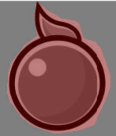
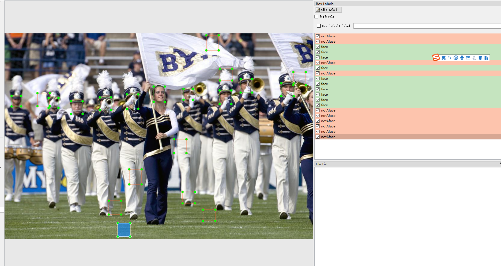
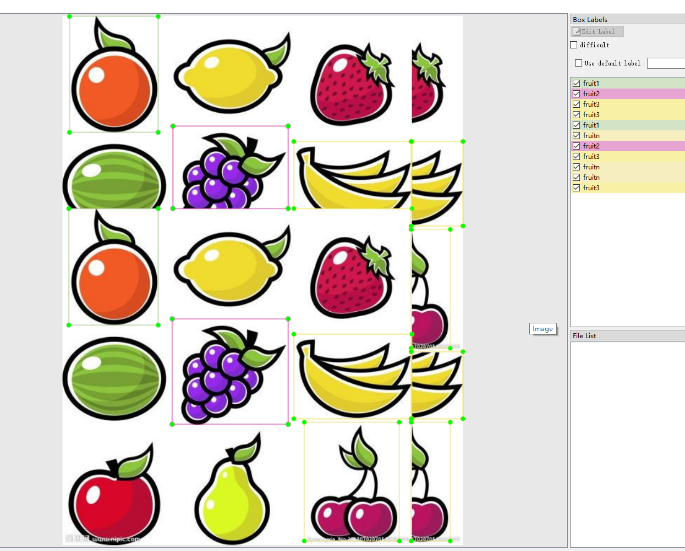
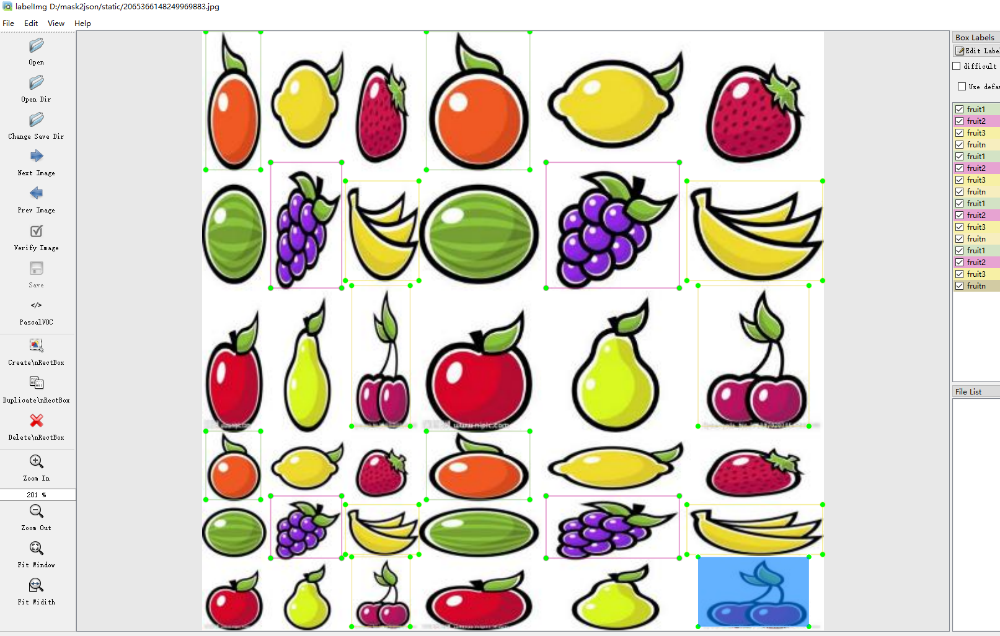
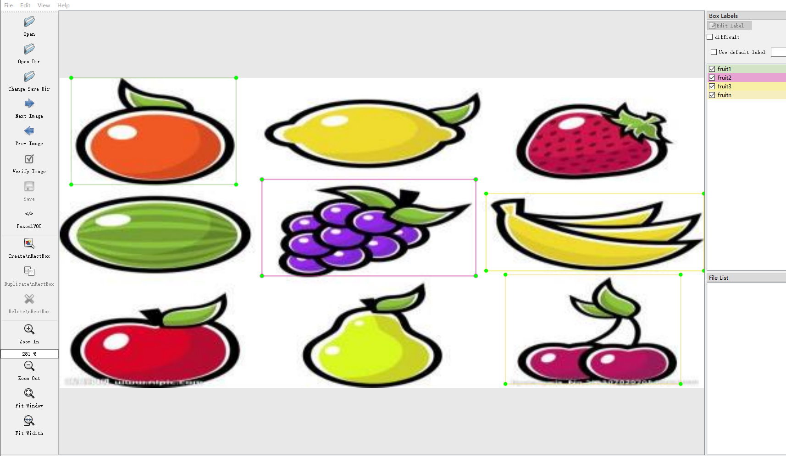

<!--
 * @lanhuage: markdown
 * @Descripttion: 
 * @version: 
 * @Author: xiaoshuyui
 * @Date: 2020-06-09 16:23:03
 * @LastEditors: xiaoshuyui
 * @LastEditTime: 2020-11-25 15:11:23
--> 
<h1 align="center">
   convertmask
</h1>

# Issues and advices wanted.

# Introduction

 A small tool for image augmentation, including mask files to json/xml files , image augmentation(flip,rotation,noise,...) and so on

 ## HOW TO USE.

 ### Installation.

 Try:

    pip install -r requestments.txt

 IF ERROR, try:

    pip install -r requirements.txt --ignore-installed

### Use.

Under this version, these tools are provided.

#### 1.[augmentation](./static/docs/augment.md)

#### 2.[img2xml](./static/docs/img2xml.md)

#### 3.[json2mask](./static/docs/json2mask.md)

#### 4.[json2xml](./static/docs/json2xml.md)

#### 5.[longImgSplit](./static/docs/longImgSplit.md)

#### 6.[xml2json](./static/docs/xml2json.md)

#### 7.[xml2mask](./static/docs/xml2mask.md)

#### 8.[xml2yolo](./static/docs/xml2yolo.md)

#### 9.[yolo2xml](./static/docs/yolo2xml.md)

#### 10.[mask2json](./static/docs/mask2json.md)

# CHANGE LOGS

## 2020.11.25

### 1. negative sample AUTOMATICLY randomly generate. I am not sure if it is helpful to my face detection cnn.

### 2. rewrite [mosaic.py](./convertmask/utils/auglib/optional/mosaic.py)(without resize the origin images). See [here](./test_scripts/test_mosiac.py).

## 2020.11.16

### 1.support converting widerface annotations to xmls. see [here](./test_scripts/test_convertWiderface.py)

## 2020.11.10

### 1. object-oriented rewrite augumentation optional module. See [here](./convertmask/utils/auglib/optionsOperatorWithoutLabel.py). Test script can be found [here](./test_scripts/test_optionalOperation.py)

## 2020.10.25

### 1. bump to 0.5.3

### 2. code structure change

### 3. mosiac(yolov4) augumentation supported(auto labeled for labelImg,for labelme will be updated as fast as i can). Script can be found [here](./test_scripts/test_mosiac.py)

## 2020.10.24

### 1.image crop supported.(single and multiple crops,rectangle and polygon support. See [here](./convertmask/utils/auglib/optional/crop.py))

### 2.image resize supported (auto labeled). See [here](./convertmask/utils/auglib/optional/resize.py) and the test script is [here](./test_scripts/test_resize.py)

## 2020.10.23

### 1.image distortion supported.

see [here](./convertmask/utils/auglib/optional/distort.py) or [test-script](./test_scripts/test_localWrap.py) for details.

## 2020.10.13

### 1.image augumentation support convert yolo txts to xmls(pascal). See [here](./test_scripts/test_yolo2xml.py)

### 2.speed up by using multiprocess

## 2020.10.12

### 1.image augumentation support generating several annotation/images with single image/annotation(json,xml). See [here](./test_scripts/test_multiAug.py)

## 2020.9.24

### 1.inspired by [LabelImgTool](https://github.com/lzx1413/LabelImgTool), convert xmls to jsons is useful. Also ,i forked this repo and add some pyqt5/py3 support,see [here](https://github.com/guchengxi1994/LabelImgTool).

examples:

script [here](./test_scripts/test_xml2json.py)

## 2020.8.24

### 1.support convert xml files to yolo files. see [here](./test_scripts/test_xml2yolo.py)

examples:

## 2020.8.19

### 1. image translation supported.

combination of every augmentation method.

### 2. besides, a simple way convert json file(labelme) to xml file(labelImg) is provided. see [here](./test_scripts/test_json2xml.py)

## 2020.8.17

### 1. bug fix.

### 2. support image augmentation methods: noise,flip,rotation. try [test_imgAug.py](./test_scripts/test_imgAug.py) !

here are some examples:

### flip

### noise

### rotation

## 2020.8.14

### 1. add image augmentation  (image flip) test. see [test_imgAug.py](./test_scripts/test_imgAug.py) !

## 2020.7.14

### 1.bugfix , test multi objects to xml files, pretty xmls

eg:

## 2020.7.13

### 1. convert multi objects to xml files supported (untested)

## 2020.7.10

### 1. a lot of things to do ,such as many warnings related to labelme.

## 2020.6.12

### 1.support multiple objects mask to json

try [test.py](./test_scripts/test.py) !

#### 1.1 multiple objects in different classes

manually_labeled image

auto_labeled image

#### 1.2 multiple objects in same classes

manually_labeled image

auto_labeled image

# what to do next

## 1. ~~support multiple files image augmentation~~ (2020.8.21)

## 2. ~~support image augmentation without a label/json file~~  (2020.8.21)

## 3. ~~support image augmentation with a labeled file (just support json file right now)~~ (2020.9)

## 4. image augmentation supports custom parameters (auto augmented right now)

## 5. do something more interesting

## 6. ~~re-write main [script](./convertmask/main_v_0_3_any.py)~~ (2020.10)

## 7. solve PyYmal installation error(currently write a [script](./convertmask/utils/methods/yamlUtils.py) by myself. maybe failure in the end.)

## 8. ~~image augmentation zoooom~~ (2020.10.14) 

# OTHERS

1. [issue:json2mask has no output](https://github.com/guchengxi1994/mask2json/issues/3)

if you test the [json2mask.py](./test_scripts/json2mask.py) script, you should change the path first and make sure the file is valid(maybe i have deleted :) )

Also, this script is just a reverse of mask2json, for a more COOOOOL method, see [here](./convertmask/utils/json2mask/convert.py) , try convert.processor

#  SHORTCOMING

1.~~objects connected to each other is not supported yet.~~

this may happen if you labelling multiple-object-images with only 2 labels .Or some objects are of the same type and are connected to each other(eg. a bunch of grapes,it is hard to split one to the other).

2.Image Binarization [issue](https://github.com/guchengxi1994/mask2json/issues/14)
